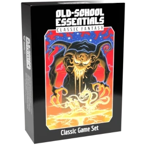

Bem vindo à tradução não oficial do Old-School Essentials SRD!

# Sobre o Old-School Essentials

*Old-School Essentials* é um RPG de aventura fantástica, monstros e magia!

**Regras simples e robustas**: *Old-School Essentials* possui regras leves e fáceis de modificar, com foco na imaginação compartilhada, improvisação e diversão.

**Fácil de aprender e consultar**: *Old-School Essentials* é meticulosamente editado e estruturado, com o objetivo de maximizar a facilidade de consulta durante o jogo. Tudo é organizado de forma lógica e apresentado em um formato de leitura rápida baseado em "painéis de controle" — páginas lado a lado apresentando um único tópico em sua totalidade.

**Compatível com décadas de material**: *Old-School Essentials* é baseado nas regras clássicas Basic/Expert (B/X) de 1981, a edição mais popular do jogo entre os conhecedores de RPGs *old-school*. Todo o material escrito para as regras B/X nas últimas quatro décadas pode ser usado com *Old-School Essentials*, sem qualquer esforço de conversão!

**Regras 100% antigas, design 100% moderno!**

> Em contato com o suporte da Necrotic Gnome, nos foi dito que a SRD contém o mesmo material que o [Classic Fantasy Rules Tome](https://necroticgnome.com/products/old-school-essentials-rules-tome). Assim também a caixa [Classic Game Set](https://necroticgnome.com/products/old-school-essentials-classic-fantasy-box-set), só que dividido em 5 livros.

# Sobre a Tradução

Este documento está sob constante atualização.

Os trabalhos de tradução foram iniciados por **Franciolli Araújo** e **Pedro Luiz** do blog [Dados Místicos](https://dadosmisticos.com/) em 14/04/2020 e concluídos em 03/07/2022.

**O processo de revisão ainda está incompleto**.

A tradução foi iniciada em 2020, quando a [wiki da SRD em inglês](https://oldschoolessentials.necroticgnome.com/) já estava completa. No entanto, a partir de 2022 toda a wiki foi revisada e a maioria dos textos sofreu pequenas atualizações. Em alguns casos é apenas mudança de formatação. Em outros houve mudança textual. Não parece ter havido mudança de regras.

✔️ - Quando este símbolo aparecer ele indica que a seção correspondente teve seu conteúdo atualizado para a versão 2022 da wiki inglesa do OSE. Indica também que a tradução foi revisada.

## Suporte

Todo o desenvolvimento deste SRD é **open source** e você pode acompanhar pelo [GitHub](https://github.com/pedroleone/osr-srd). Se estiver interessado em ajudar, você pode abrir [*issues*](https://github.com/pedroleone/osr-srd/issues) informando erros, sugestões ou mesmo solicitando acesso para se tornar contribuidor oficial. Fique à vontade para fazer um [*pull request*](https://docs.github.com/pt/pull-requests/collaborating-with-pull-requests/proposing-changes-to-your-work-with-pull-requests/creating-a-pull-request) também.

## Equipe de Tradutores

Todos que contribuíram de alguma forma conforme a plataforma [GitHub](https://github.com/pedroleone/osr-srd/graphs/contributors):

* Bruno Assis
* Cairo Noleto
* Daniel Dias Rodrigues
* Franciolli da Silva Dantas de Araújo
* Ícaro Agostino
* Igor Teuri
* Luan Morelatto
* Lucio Muller de Siqueira
* Paulo E. R. Weber
* Pedro Luiz Leone

